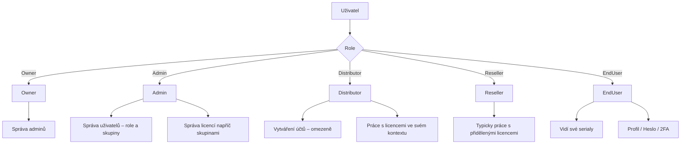
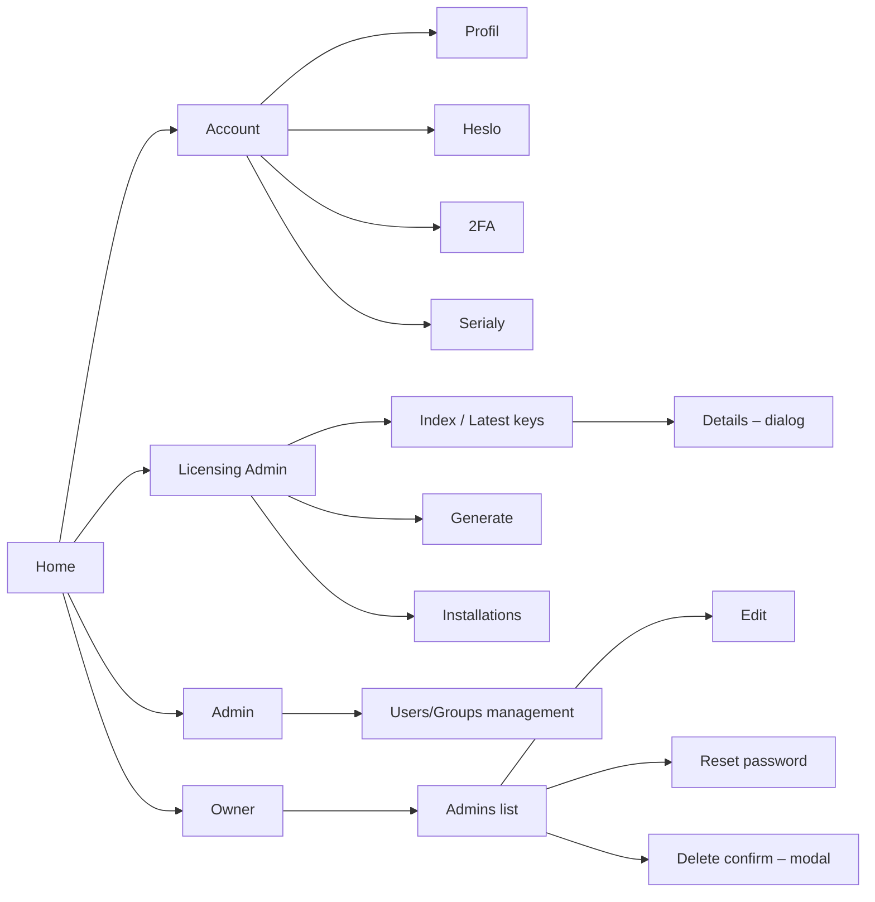
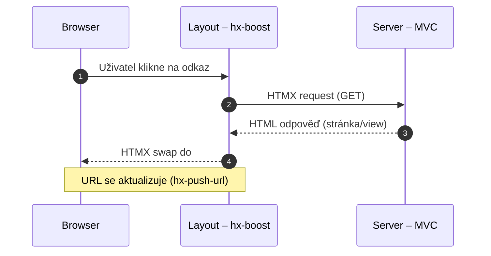
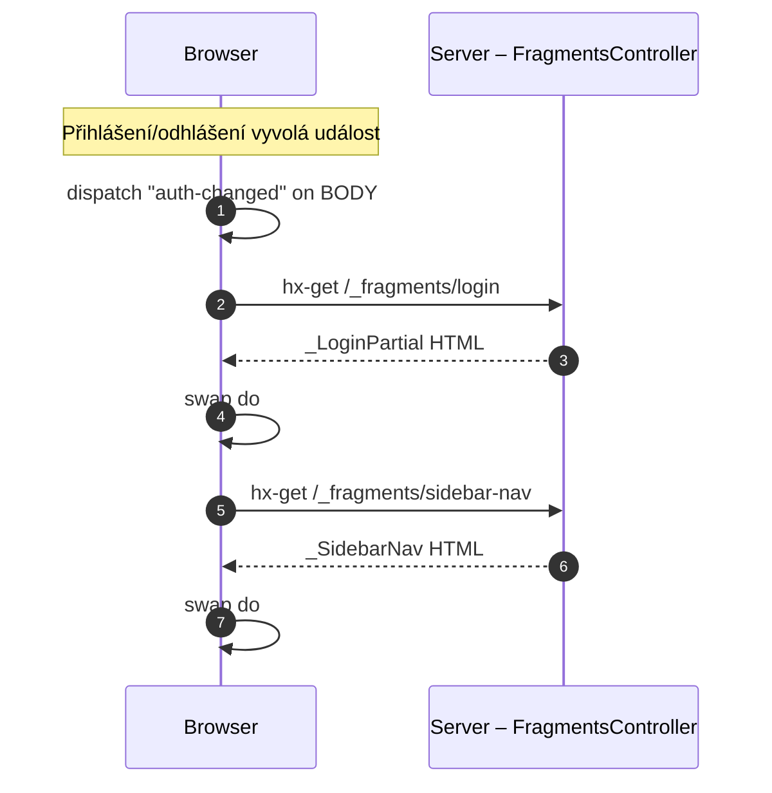
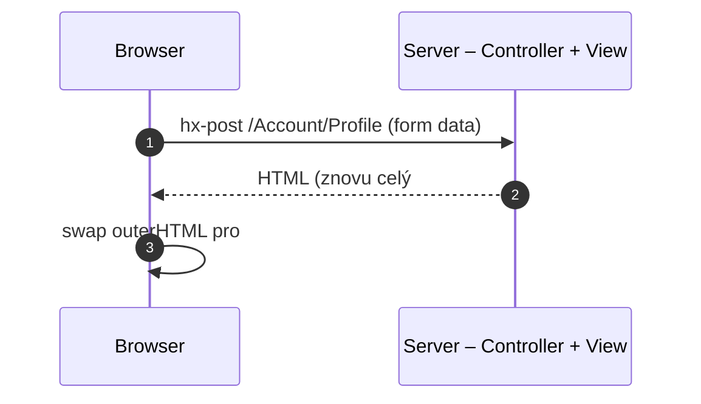
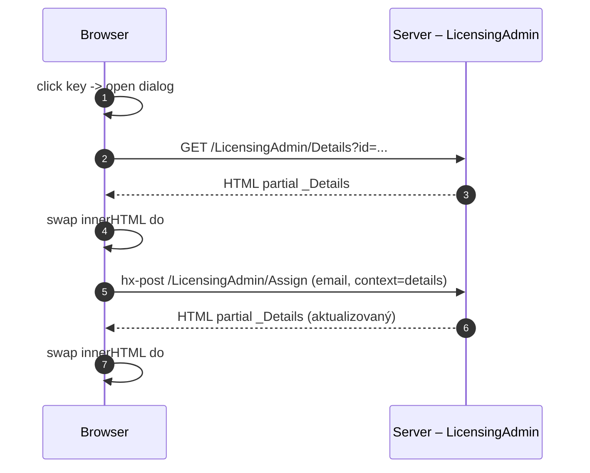
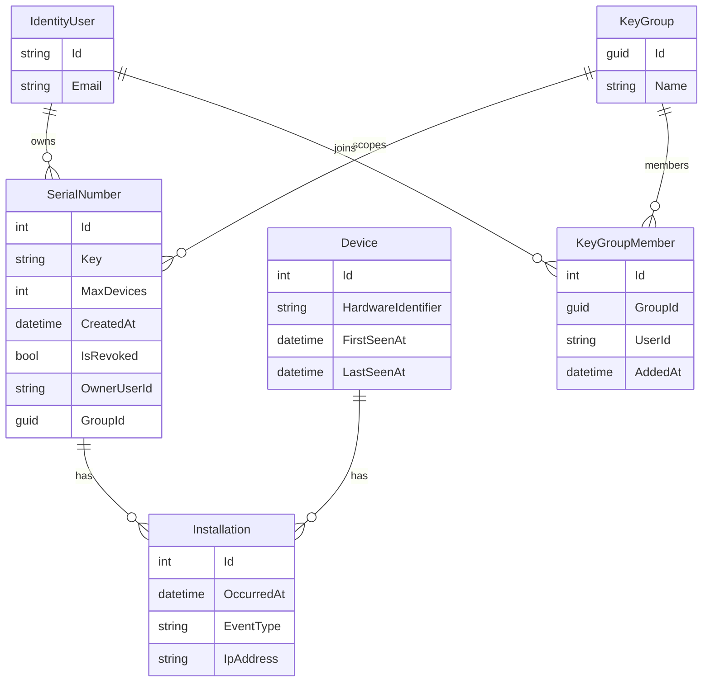
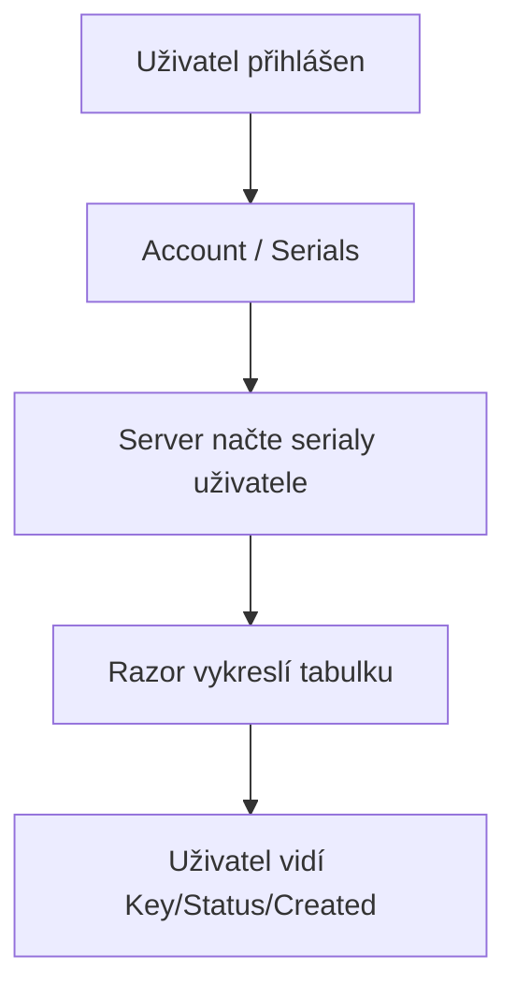
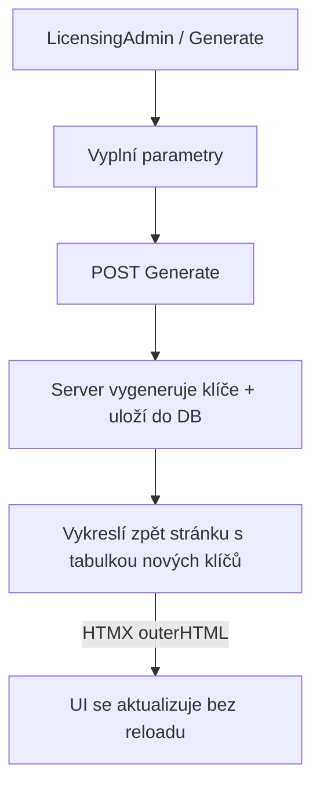
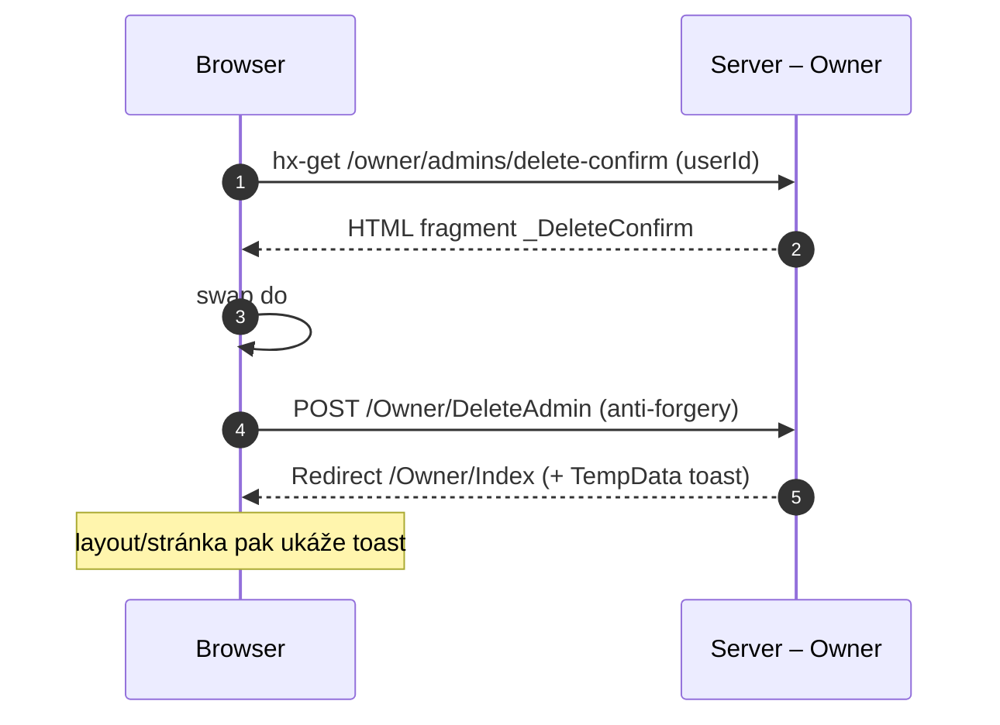

# Digitální produkty – princip a použití (graficky)

Tento dokument je „vizuální mapa“ aplikace: kdo ji používá, jaké jsou hlavní obrazovky a jak spolu komunikují server, databáze a HTMX.

> Pozn.: Diagramy jsou v Mermaid. Ve VS Code je zobrazíte např. rozšířením pro Mermaid, na GitHubu se většinou rendrují automaticky.

---

## 1) Kontext: co aplikace dělá

- Aplikace spravuje **licenční klíče (serial numbers)** a jejich **přiřazení uživatelům**.
- Evidence zahrnuje **instalace** (události), **zařízení**, **skupiny** (key groups) a **uživatelské role**.
- UI je klasické ASP.NET MVC/Razor, ale navigace a část akcí je optimalizovaná přes **HTMX** (částečné přenačítání a fragmenty).

---

## 2) Role a oprávnění (kdo co může)

---

## 3) Hlavní obrazovky (navigace aplikace)

---

## 4) Princip fungování UI s HTMX

Aplikace používá kombinaci:
- **Klasická MVC navigace** (odkazy a stránky),
- **HTMX „boost“ navigace**: klik na odkaz často nenačítá celou stránku, ale jen obsahový panel,
- **Fragmenty**: dílčí části layoutu (např. login box / sidebar) se dají přerenderovat samostatně.

### 4.1 „Boost“ navigace (výměna `#main`)

### 4.2 Fragmenty (sidebar/login) po změně přihlášení

### 4.3 HTMX formuláře: „vrať mi znovu kartu“

Častý vzor v auth/account view:
- formulář má `hx-post`,
- cílí na `#...-card`,
- server vrátí **znovu celý card** (včetně validace/toastu),
- HTMX provede `outerHTML` swap.

### 4.4 Detail v dialogu (LicensingAdmin)

- Tabulka „Latest keys“ otevře detail přes JS (otevře `<dialog>`),
- detail se typicky dotáhne jako partial (`_Details`) do `#license-details-body`,
- akce uvnitř detailu (Assign/Revoke/Transfer…) používají `hx-post` a aktualizují jen obsah dialogu.

---

## 5) Datový model (zjednodušeně)

---

## 6) Typické scénáře použití

### 6.1 End-user: prohlédnutí vlastních serialů

### 6.2 Admin/Distributor: generování klíčů

### 6.3 Owner: mazání admin účtu s potvrzením (modal)

---

## 7) Kde hledat konkrétní implementaci

- Layout + globální HTMX nastavení: `Views/Shared/_Layout.cshtml`
- Fragment endpointy (sidebar/login): `Controllers/FragmentsController.cs`
- Licence (index/generate/details/installations): `Controllers/LicensingAdminController.cs` + `Views/LicensingAdmin/*`
- Owner správa adminů: `Controllers/OwnerController.cs` + `Views/Owner/*`
- Account (profil/heslo/2FA/serials): `Controllers/AccountController.cs` + `Views/Account/*`
- Identity auth flow: `Controllers/AuthController.cs` + `Views/Auth/*`

---

## 8) Legenda HTMX atributů (rychlá)

- `hx-boost="true"`: promění běžné odkazy/formy na HTMX requesty (XHR) – typicky bez full reload.
- `hx-target="..."`: kam se má vložit odpověď.
- `hx-swap="innerHTML"|"outerHTML"`: jak se odpověď vloží (jen obsah vs. celý element).
- `hx-trigger="..."`: kdy se request spustí (např. `load`, `change`, nebo custom event `foo from:body`).
- `hx-include="..."`: které další inputy/pole se mají poslat v requestu.
- `hx-vals='{"k":"v"}'`: doplní do requestu hodnoty (často pro jednoduché parametry).
